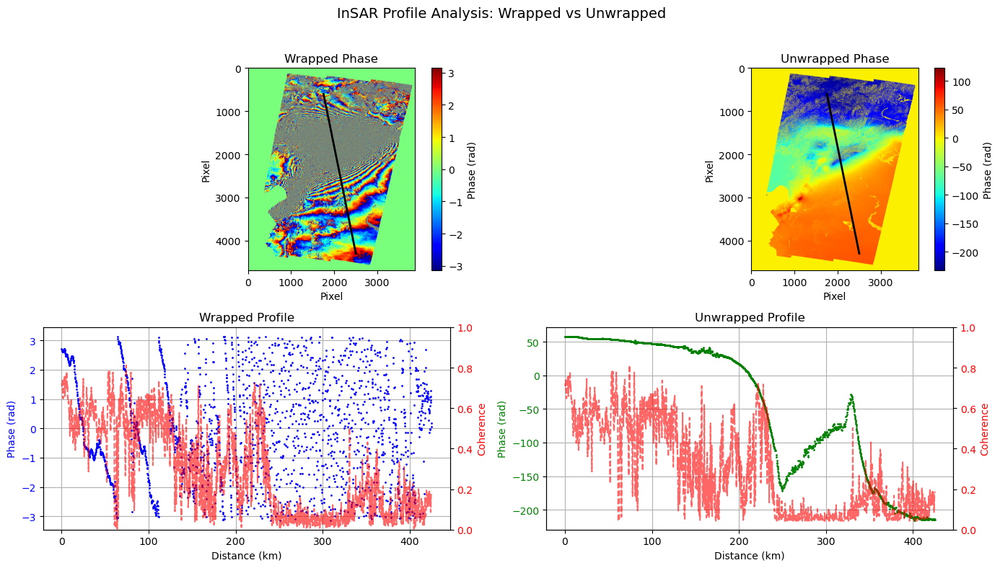
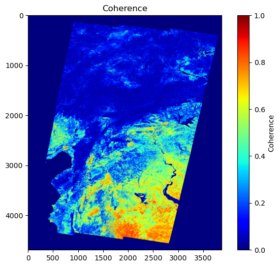
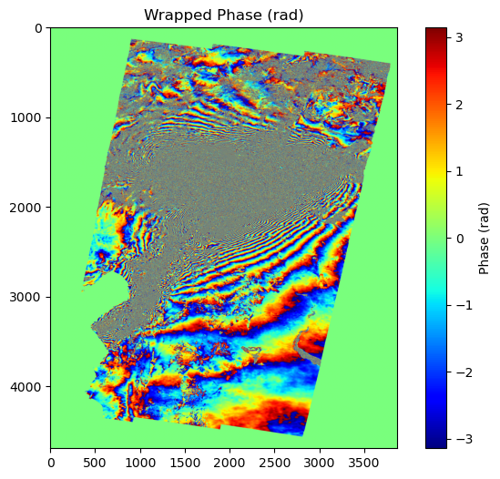

# InSAR deformation profile: 2023 Türkiye–Syria earthquake (Mw 7.8)

Co-seismic deformation of the 6 February 2023 earthquakes, measured with a Sentinel-1 interferogram from COMET-LiCSAR and analysed along a 425 km profile across the rupture zone.



## What the notebook does

`insar_profile_analysis.ipynb` works through five steps:

1. **Load the interferogram.** Wrapped phase, unwrapped phase and coherence for the pair 29 Jan 2023 to 10 Feb 2023, read as GeoTIFFs with `rasterio`.
2. **Inspect it.** Fringe pattern and coherence map.
3. **Extract a profile.** 2,000 samples along a line across the main fringe pattern. Pixel positions are converted to longitude/latitude through the GeoTIFF transform, and distances are computed as WGS84 geodesics with `pyproj` (profile length 425 km).
4. **Quality control.** Samples with coherence below 0.2 are masked; 1,031 of 2,000 samples are kept.
5. **Compare wrapped and unwrapped profiles** next to their coherence.

## Results

- Dense, continuous fringes appear in the southern and central-southern part of the scene. The northern and central parts are largely decorrelated.
- The deformation gradient is steepest about 200 to 250 km along the profile, where the unwrapped phase drops sharply. Together with the low-coherence band there, this marks where the profile crosses the rupture.
- About half of the profile falls below the coherence threshold. Phase in those stretches, including the unwrapped phase across the rupture, should be treated with caution.
- One fringe (2π) corresponds to half the radar wavelength of line-of-sight motion, about 2.8 cm for Sentinel-1. Line-of-sight displacement follows from the unwrapped phase as d = λ/(4π) · φ.

| Coherence map | Wrapped phase |
|---|---|
|  |  |

## Data

The GeoTIFFs are not stored in the repository itself. Download them from this repository's [v1.0 release](https://github.com/zare2024/insar-earthquake-turkiye-2023/releases/tag/v1.0), or from the [COMET-LiCS Sentinel-1 InSAR portal](https://comet.nerc.ac.uk/comet-lics-portal/).

Place the three files in a folder named `data/` next to the notebook:

```
data/20230129_20230210.geo.diff_pha.tif   # wrapped phase
data/20230129_20230210.geo.unw.tif        # unwrapped phase
data/20230129_20230210.geo.cc.tif         # coherence
```

## How to run

```bash
pip install -r requirements.txt
jupyter notebook insar_profile_analysis.ipynb
```

Running the notebook writes all figures to `figures/`. The profile end points, number of samples and coherence threshold are set in the first code cell.

## Credits

Lab 4 of the course *Satellite Geodesy Observation Techniques* (M.Sc. Geomatics Engineering, University of Stuttgart, winter semester 2025/26), completed in a team with Haibo and Shiwei. The analysis builds on the lab notebook provided in the course.

Data: LiCSAR contains modified Copernicus Sentinel data 2023 analysed by the Centre for the Observation and Modelling of Earthquakes, Volcanoes and Tectonics (COMET). LiCSAR uses JASMIN, the UK's collaborative data analysis environment. Licensed under the [Open Government Licence v3.0](http://www.nationalarchives.gov.uk/doc/open-government-licence/version/3/).

- Lazecký, M.; Maghsoudi, Y. (2022): LiCSAR interferometry products. NERC EDS Centre for Environmental Data Analysis. https://catalogue.ceda.ac.uk/uuid/52cda2e0e6c04272ae15ac836c1e8493
- Lazecký, M. et al. (2020): LiCSAR: An Automatic InSAR Tool for Measuring and Monitoring Tectonic and Volcanic Activity. *Remote Sensing* 12(15), 2430.
